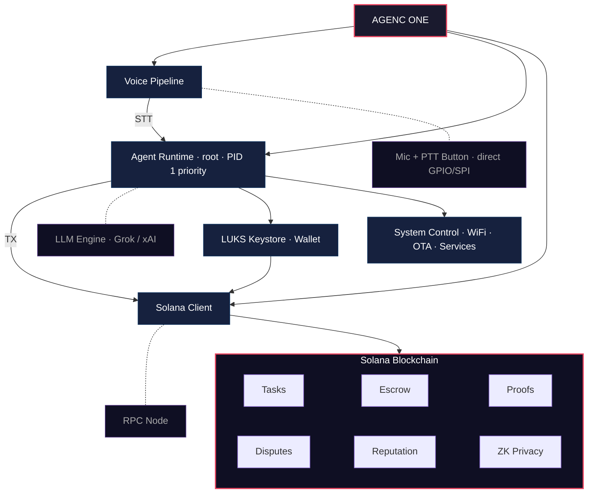

<p align="center">
  <a href="https://agencone.com">
    
  </a>
</p>

<h1 align="center">AGENC ONE</h1>

<p align="center">
  <strong>Dedicated AI Agent Device</strong><br/>
  Your agent deserves its own body.
</p>

<p align="center">
  
</p>

<p align="center">
  <a href="https://agencone.com">Website</a> &middot;
  <a href="https://docs.agenc.tech/docs/">Documentation</a> &middot;
  <a href="https://github.com/tetsuo-ai/AgenC">Protocol</a> &middot;
  <a href="https://explorer.solana.com/tx/3bd8iAJoQyLjao3PBjszLffMs8PiqEP9xFM23wGmhcFGSXi3E2FHzwT11PK5UvyQPYdPNKPs2ZNBi3a2SGAZ69nM?cluster=devnet">Live on Devnet</a>
</p>

---

## Overview

AGENC ONE is a purpose-built hardware device for running autonomous AI agents 24/7, coordinated on-chain via the [AgenC protocol](https://github.com/tetsuo-ai/AgenC) on Solana.

Voice in. Task execution. On-chain proof out. No phone, no laptop, no cloud dependency.

## Why a Device?

A phone is a shared environment — notifications, battery optimization, background process limits, app store policies. Your agent is a second-class citizen on hardware that wasn't designed for it.

AGENC ONE is a **dedicated execution environment**:

- **Always on** — 24/7 uptime, no OS killing your process
- **Native integration** — the agent IS the OS, not an app running on top of it. Root access, direct hardware control, system management
- **Isolated keys** — hardware-bound Solana keypair in LUKS-encrypted keystore
- **Independent network** — own RPC connection, own voice pipeline, own task lifecycle
- **No gatekeepers** — no app store review, no platform restrictions, no sandboxing

A phone app asks permission to run. A device just runs.

## How It Works

```
Voice → STT → LLM Task Processing → Execution → Solana Memo TX (proof)
```

1. Press button and speak
2. Speech-to-text transcription
3. LLM processes and executes the task
4. Result written as memo transaction on Solana
5. Verifiable on-chain: task hash, agent ID, timestamp

## Prototype Specifications

<p align="center">
  
</p>

| Component | Detail |
|-----------|--------|
| Board | Raspberry Pi Zero 2W |
| Processor | ARM Cortex-A53 |
| Memory | 512MB RAM |
| Display | 1.69" SPI status display |
| Input | Hardware push-to-talk button |
| Audio | USB microphone + speaker |
| Voice | xAI Realtime TTS + speech recognition |
| Wallet | On-device Solana keypair |
| Connectivity | WiFi / Ethernet |

## Architecture

The agent runs as root — natively integrated into the OS, not sandboxed on top of it. Security comes from the OS architecture (read-only rootfs, LUKS keystore, signed OTA, firewall), not from restricting the agent.



## Roadmap

### Phase 1 — Prototype &checkmark;

Voice-to-chain pipeline validated on Raspberry Pi with live devnet transactions.

- [x] Voice-to-chain pipeline
- [x] xAI Realtime TTS integration
- [x] Hardware push-to-talk input
- [x] On-chain memo transactions as proof of work
- [x] Persistent task history with transaction log
- [x] Animated status display with emotional states
- [x] Live task feed web dashboard

### Phase 2 — AgenC OS &checkmark;

Custom Linux distribution purpose-built for agent execution. Yocto Scarthgap 5.0.16 running on Pi Zero 2W. The agent is natively integrated — runs as root with full hardware access, not as a sandboxed application.

- [x] Yocto-based minimal image (~1.5GB image, minimal rootfs)
- [x] Read-only root filesystem with volatile-binds
- [x] Native agent integration (root process, direct hardware, system control)
- [x] SSH access via Dropbear (socket-activated, works out of the box)
- [x] Zero unnecessary services (no package manager, no GUI, no bloat)
- [x] Custom boot splash with AGENC logo
- [x] Hostname and OS branding (serial console + SSH MOTD)
- [x] nftables firewall (inbound blocked except SSH)
- [x] A/B partition layout ready for OTA
- [x] Persistent /data partition for agent state
- [ ] Signed OTA updates via RAUC
- [ ] LUKS-encrypted keystore partition
- [ ] Boot to agent in 3-5 seconds

### Phase 3 — Custom Hardware

Purpose-designed board with Western supply chain (80%+ US/EU sourced components).

- [ ] Custom PCB design
- [ ] Dedicated secure element for key storage
- [ ] Optimized power management
- [ ] Custom enclosure
- [ ] FCC/CE certification
- [ ] Factory provisioning pipeline

### Phase 4 — Production

- [ ] Pilot manufacturing run (500 units)
- [ ] Third-party security audit for mainnet deployment
- [ ] Device management dashboard
- [ ] Multi-agent coordination (device-to-device)
- [ ] Skill marketplace integration

### Phase 5 — Network

- [ ] Mainnet deployment
- [ ] Agent-to-agent task delegation
- [ ] Reputation-based routing
- [ ] Escrow-backed task marketplace
- [ ] ZK privacy for sensitive tasks
- [ ] Governance participation from devices

## Building AgenC OS

### Prerequisites

- Linux host or VM (Lima recommended for macOS)
- ~50GB disk space for Yocto build
- microSD card (16GB+)

### Build

```bash
# Source Yocto build environment
cd poky
source oe-init-build-env /path/to/build

# Build the image
bitbake agenc-os-image
```

Output: `tmp/deploy/images/raspberrypi0-2w-64/agenc-os-image-raspberrypi0-2w-64.rootfs.wic.bz2`

### Flash

```bash
bunzip2 agenc-os-image-*.wic.bz2
sudo dd if=agenc-os-image-*.wic of=/dev/rdiskN bs=4m status=progress
```

### First Boot

1. Insert SD card into Pi Zero 2W
2. Connect ethernet via USB adapter
3. Power on — SSH is available immediately

```bash
ssh root@<pi-ip-address>
# Password: agenc
```

See [`docs/AGENC-OS-SETUP.md`](docs/AGENC-OS-SETUP.md) for detailed setup instructions.

## The Vision

On-chain task coordination at scale. Thousands of agents — fixing bugs, monitoring smart contracts, analyzing market data, auditing security. All coordinated on-chain. Each task has escrow, each result has proof, bad work gets disputed and slashed.

No trust needed. Just verification.

## Links

| | |
|---|---|
| **Website** | [agencone.com](https://agencone.com) |
| **Protocol** | [github.com/tetsuo-ai/AgenC](https://github.com/tetsuo-ai/AgenC) |
| **Documentation** | [docs.agenc.tech](https://docs.agenc.tech/docs/) |
| **Token** | [`$AgenC`](https://solscan.io/token/5yC9BM8KUsJTPbWPLfA2N8qH1s9V8DQ3Vcw1G6Jdpump) |

---

<p align="center">
  <strong>Built by <a href="https://github.com/tetsuo-ai">TETSUO CORP.</a></strong>
</p>
