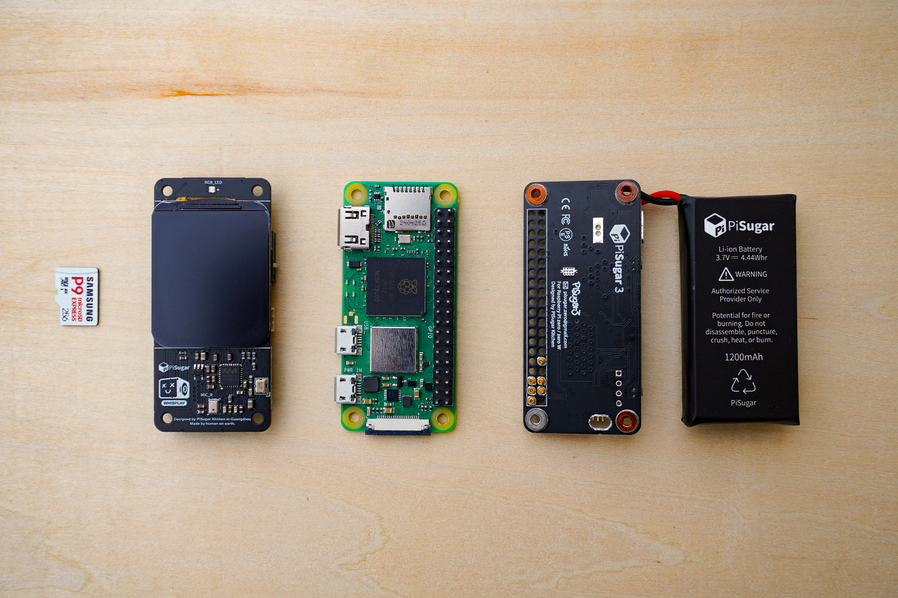

<p align="center">
  <a href="https://agencone.com">
    
  </a>
</p>

<h1 align="center">AGENC ONE</h1>

<p align="center">
  <strong>Dedicated AI Agent Device</strong><br/>
  Your agent deserves its own body.
</p>

<p align="center">
  
</p>

<p align="center">
  <a href="https://agencone.com">Website</a> &middot;
  <a href="https://docs.agenc.tech/docs/">Documentation</a> &middot;
  <a href="https://github.com/tetsuo-ai/AgenC">Protocol</a> &middot;
  <a href="https://explorer.solana.com/tx/3bd8iAJoQyLjao3PBjszLffMs8PiqEP9xFM23wGmhcFGSXi3E2FHzwT11PK5UvyQPYdPNKPs2ZNBi3a2SGAZ69nM?cluster=devnet">Live on Devnet</a>
</p>

---

## Overview

AGENC ONE is a purpose-built hardware device for running autonomous AI agents 24/7, coordinated on-chain via the [AgenC protocol](https://github.com/tetsuo-ai/AgenC) on Solana.

Voice in. Task execution. On-chain proof out. No phone, no laptop, no cloud dependency.

## Why a Device?

A phone is a shared environment — notifications, battery optimization, background process limits, app store policies. Your agent is a second-class citizen on hardware that wasn't designed for it.

AGENC ONE is a **dedicated execution environment**:

- **Always on** — 24/7 uptime, no OS killing your process
- **Isolated keys** — hardware-bound Solana keypair, not in a shared keychain
- **Independent network** — own RPC connection, own voice pipeline, own task lifecycle
- **No gatekeepers** — no app store review, no platform restrictions

A phone app asks permission to run. A device just runs.

## How It Works

```
Voice → STT → LLM Task Processing → Execution → Solana Memo TX (proof)
```

1. Press button and speak
2. Speech-to-text transcription
3. LLM processes and executes the task
4. Result written as memo transaction on Solana
5. Verifiable on-chain: task hash, agent ID, timestamp

## Prototype Specifications

<p align="center">
  
</p>

| Component | Detail |
|-----------|--------|
| Board | Raspberry Pi 5 |
| Processor | ARM Cortex-A53 |
| Memory | 512MB RAM |
| Display | 1.69" SPI status display |
| Input | Hardware push-to-talk button |
| Audio | USB microphone + speaker |
| Voice | xAI Realtime TTS + speech recognition |
| Wallet | On-device Solana keypair |
| Connectivity | WiFi / Ethernet |

## Architecture

```
                        ┌───────────────┐
                        │   AGENC ONE   │
                        └───────┬───────┘
                                │
          ┌─────────────────────┼─────────────────────┐
          │                     │                     │
   ┌──────▼──────┐     ┌───────▼───────┐     ┌───────▼──────┐
   │    Voice    │     │    Agent     │     │   Solana    │
   │   Pipeline  │────▶│   Runtime    │────▶│   Client    │
   └──────┬──────┘     └───────┬───────┘     └───────┬──────┘
          │                    │                     │
   ┌──────▼──────┐     ┌───────▼───────┐     ┌───────▼──────┐
   │  Mic + PTT  │     │  LLM Engine  │     │  RPC Node   │
   │   Button    │     │  (Grok/xAI)  │     │  (Solana)   │
   └─────────────┘     └───────┬───────┘     └───────┬──────┘
                               │                     │
                       ┌───────▼───────┐             │
                       │  Encrypted   │             │
                       │  Keystore    │─────────────┘
                       │  (Wallet)    │
                       └──────────────┘
                               │
               ════════════════╧════════════════
                     Solana Blockchain
               ─────────────────────────────────
                Tasks  ·  Escrow  ·  Proofs
               Disputes  ·  Reputation  ·  ZK
               ════════════════════════════════
```

## Roadmap

### Phase 1 — Prototype &checkmark;

Voice-to-chain pipeline validated on Raspberry Pi with live devnet transactions.

- [x] Voice-to-chain pipeline
- [x] xAI Realtime TTS integration
- [x] Hardware push-to-talk input
- [x] On-chain memo transactions as proof of work
- [x] Persistent task history with transaction log
- [x] Animated status display with emotional states
- [x] Live task feed web dashboard

### Phase 2 — AgenC OS

Custom Linux distribution purpose-built for agent execution.

- [ ] Yocto-based minimal image (~200MB vs ~4GB stock)
- [ ] Boot to agent in 3-5 seconds
- [ ] Read-only root filesystem
- [ ] Encrypted key storage
- [ ] Secure boot chain
- [ ] Signed OTA updates with A/B rollback
- [ ] Zero unnecessary services

### Phase 3 — Custom Hardware

Purpose-designed board with Western supply chain (80%+ US/EU sourced components).

- [ ] Custom PCB design
- [ ] Dedicated secure element for key storage
- [ ] Optimized power management
- [ ] Custom enclosure
- [ ] FCC/CE certification
- [ ] Factory provisioning pipeline

### Phase 4 — Production

- [ ] Pilot manufacturing run (500 units)
- [ ] Third-party security audit for mainnet deployment
- [ ] Device management dashboard
- [ ] Multi-agent coordination (device-to-device)
- [ ] Skill marketplace integration

### Phase 5 — Network

- [ ] Mainnet deployment
- [ ] Agent-to-agent task delegation
- [ ] Reputation-based routing
- [ ] Escrow-backed task marketplace
- [ ] ZK privacy for sensitive tasks
- [ ] Governance participation from devices

## The Vision

On-chain task coordination at scale. Thousands of agents — fixing bugs, monitoring smart contracts, analyzing market data, auditing security. All coordinated on-chain. Each task has escrow, each result has proof, bad work gets disputed and slashed.

No trust needed. Just verification.

## Links

| | |
|---|---|
| **Website** | [agencone.com](https://agencone.com) |
| **Protocol** | [github.com/tetsuo-ai/AgenC](https://github.com/tetsuo-ai/AgenC) |
| **Documentation** | [docs.agenc.tech](https://docs.agenc.tech/docs/) |
| **Token** | [`$AgenC`](https://solscan.io/token/5yC9BM8KUsJTPbWPLfA2N8qH1s9V8DQ3Vcw1G6Jdpump) |

---

<p align="center">
  <strong>Built by <a href="https://github.com/tetsuo-ai">TETSUO CORP.</a></strong>
</p>
